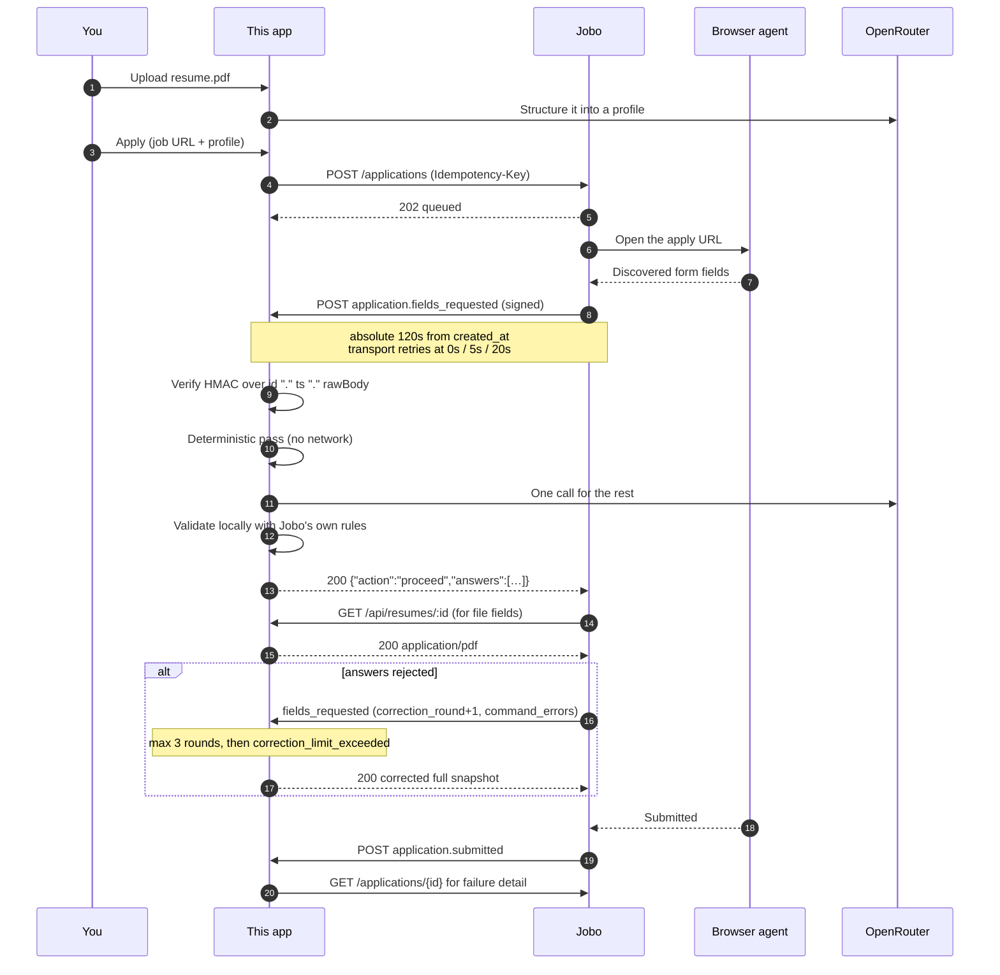

# Jobo Auto Apply — Next.js example

Import a resume as a profile, paste a job URL, and watch Jobo drive the ATS form while this app answers its questions over a signed webhook.

**The app is a guided tutorial.** Open it and it walks you through the integration in five steps — verify your setup, own the profile, create an application, answer the callback, go live — with each step teaching the API concept it exercises: the actual code that runs, the actual bytes on the wire, and a live view of your webhook answering. Progress is derived entirely from real state (env + SQLite), never stored; once you have watched one application reach a terminal state, the front page becomes a plain workbench.

**The interesting file is [`app/api/jobo/webhook/route.ts`](app/api/jobo/webhook/route.ts).** Everything else exists to give it something to answer with — and to teach you why.

---

## What this actually demonstrates

Auto Apply is **profileless**. Jobo stores no candidate profile, uploads no resume, and generates no answers. The entire public API is four endpoints:

```
POST   /api/auto-apply/applications          create
GET    /api/auto-apply/applications          list
GET    /api/auto-apply/applications/{id}     read
POST   /api/auto-apply/applications/{id}/cancel
```

There is no profile endpoint, no resume upload, and no "fetch the pending questions" endpoint. When Jobo's browser agent finds a form, it **POSTs the fields to your callback and reads the answers out of your HTTP response body**, synchronously, inside a 120-second budget.

So this app is not a client of the answer engine — it *is* the answer engine. That is the half of the integration Jobo deliberately does not own, and it is what this repo shows you how to build.



---

## Before you start: two things are not self-serve yet

**1. Application creation is gated off during the preview.** `POST /applications` returns `503` with code `auto_apply_coming_soon` until Jobo enables intake. The gate is deployment-owned — no account setting overrides it, so ask your Jobo contact to enable it for you. Reads, lists and cancels work regardless, which means you can build and test everything in this repo except the final create.

**2. The webhook secret comes from the portal API, not the public API.** It is generated by `PUT /api/auto-apply/settings` on `enterprise.jobo.world` — a *different host*, authenticated with your portal session rather than your API key — and revealed exactly once. The portal screen for this is still a placeholder, so make the call directly. `$PORTAL_JWT` is your own portal session token (copy it from the `Authorization` header of any request on the dashboard, in your browser's network tab):

```bash
curl -X PUT https://enterprise.jobo.world/api/auto-apply/settings \
  -H "Authorization: Bearer $PORTAL_JWT" \
  -H "Content-Type: application/json" \
  -d '{"default_callback_url":"https://your-tunnel.example.com/api/jobo/webhook"}'
```

The `webhook_secret` in that response is your `JOBO_WEBHOOK_SECRET`. Afterwards you can only see a fingerprint — if you lose it, rotate with `POST /api/auto-apply/settings/rotate-secret`.

Once configured, `POST /api/auto-apply/settings/verify` fires a **real signed `application.ping`** at your callback. That is the best end-to-end check available, and it shows up in this app's callback log.

---

## Quickstart

```bash
npm install
cp .env.example .env.local
```

Jobo will only call a **public HTTPS URL on port 443**. Cloudflare Tunnel needs no account and terminates on 443:

```bash
brew install cloudflared
```

Then one command, which starts the tunnel, waits for the hostname Cloudflare assigns it, and boots the dev server with that origin already in its environment:

```bash
npm run dev:tunnel
```

It prints the callback URL to give the portal. You do not set `PUBLIC_BASE_URL` yourself — a value in the environment takes precedence over `.env.local`, so leave that line as it comes.

<details>
<summary>Running the two separately</summary>

```bash
npm run dev
npm run tunnel   # in a second terminal
```

Then put the printed origin into `PUBLIC_BASE_URL` in `.env.local` and **restart the dev server** — Next.js reads server env at boot, so an edit alone does nothing. This is the loop `dev:tunnel` exists to remove.

</details>

Check everything before spending a create quota:

```bash
npm run doctor
```

`doctor` verifies the env, that your hostname resolves to a public address on port 443, that `/api/health` is reachable *through the tunnel*, your clock skew, your OpenRouter key, and your Jobo key. The same checks run in the browser on the tutorial's first step.

Then open [http://localhost:3000](http://localhost:3000) — it drops you into the tutorial at whichever step your setup has actually reached.

### A tunnel that survives restarts

A Cloudflare quick tunnel is ephemeral: every start gets a new random `*.trycloudflare.com` hostname. That costs you nothing here, because this app sends `callback_url` on every create — nothing server-side is pinned to the origin, and `dev:tunnel` keeps the churn out of your way.

It starts to matter if you set the portal's `default_callback_url` and stop passing one per application. Then you want a hostname that persists:

| | Needs | |
| --- | --- | --- |
| **Tailscale Funnel** | An account. No domain. | `tailscale funnel 3000` → a stable `https://<machine>.<tailnet>.ts.net` on 443. The least setup for a fixed hostname. |
| **Named Cloudflare tunnel** | A Cloudflare account **and** a domain on it. | `cloudflared tunnel create` + `cloudflared tunnel route dns` → your own subdomain, permanently. |
| **ngrok** | An account. | The free tier includes one static domain: `ngrok http 3000 --url=<yours>.ngrok-free.app`. |

With any of them, set `PUBLIC_BASE_URL` in `.env.local` and use plain `npm run dev` — `dev:tunnel` is only for the ephemeral case.

---

## The webhook contract in 60 seconds

> [!WARNING]
> **Never return a non-2xx from your callback.** Unlike most webhook systems, a non-2xx response is *not retried* — it fails the application immediately with `callback_rejected`. The 0s/5s/20s retries fire only for **transport** errors: connection refused, DNS failure, timeout. If your handler breaks, return `200 {"action":"cancel"}`. The application ends as `canceled` instead of `failed`, and you keep a readable audit trail.

**Signature.** HMAC-SHA256, hex, keyed by the full `whsec_…` secret:

```
HMAC(secret, utf8(eventId + "." + timestamp + ".") ‖ rawBody)
```

Compare constant-time against every `v1=` entry in `X-Jobo-Webhook-Signature` (there are two during a 24-hour rotation), and reject a timestamp more than 300s from now. **Read the raw bytes before parsing** — parse-then-restringify does not round-trip, and Jobo rewrites `attempt` into the body between retries, so the bytes genuinely differ.

You do not have to write any of that: `createCallbackHandler` from [`@jobo-ai/autoapply`](https://www.npmjs.com/package/@jobo-ai/autoapply) does it, and hands your hook the verified event plus the exact signed bytes on `context.raw`. Because Jobo signs a rotation with **both** secrets and sends two `v1=` entries, whichever single secret you hold matches one of them — there is nothing to configure and no second env var.

**The deadline is absolute, and starts at `created_at`.** 120 seconds covering every transport attempt. On the t=20s retry you have ~100s left, not 120s.

**Answer with the response body:**

```json
{ "action": "proceed", "answers": [ { "field_id": "field_email", "value": "ada@example.com" } ] }
```

or `{"action":"cancel"}` — with `answers` genuinely **absent**, since even an empty array is rejected as `answers_not_allowed`. That is why `AnswerCommand` is a discriminated union rather than an object with an optional array.

**Corrections.** Invalid answers come back as a new `fields_requested` with `command_errors` and an incremented `correction_round`. The **full field list** is re-sent, so your reply must be a complete snapshot, not a delta. After 3 rounds the application dies with `correction_limit_exceeded`.

**Dedupe on `X-Jobo-Webhook-Id`.** It is stable across retries; `X-Jobo-Delivery-Attempt` is not.

---

## The answer engine

Two passes, in this order for a reason: the deterministic pass needs no network, so an LLM timeout degrades to *fewer* answers rather than *no* answers.

| Situation | Producer | Why |
|---|---|---|
| `semantic_key` / label matches a profile field | **Rule** | Free, instant, exact. Never let a model retype an email address. |
| `type: 'file'` | **Rule** | Always the signed resume URL. |
| `repeating_group` | **Rule** | Ordering, the ≤10 cap, `is_current`/`end_date`, and dedupe are rules, not judgement. |
| Unambiguous option match | **Rule** | `country_code: "US"` onto an option `{value:"US"}`. |
| `sensitive: true` | **Neither** | See below. |
| `type: 'unknown'` | **Neither** | Unanswerable by contract. |
| Open-ended text | **LLM** | "Why this company", "describe a project". |
| Options needing semantic choice | **LLM** | "5-7 years" → the `senior` option. |

**Sensitive fields are never sent to the model.** For voluntary self-identification the order is: a value the user typed into the UI → the form's own "prefer not to say" option → leave it unanswered. Jobo does not infer these either. An example that invented someone's demographic data to get a form submitted would be teaching the wrong lesson.

**Typed slots, not a polymorphic `value`.** A `value` that is a string, number, boolean, array or object depending on a sibling field's type is exactly what strict JSON Schema handles worst, and the failure is silent. Instead the model declares a `kind` and fills the matching slot, and [`lib/answers/coerce.ts`](lib/answers/coerce.ts) turns that into the wire shape. `kind: "skip"` gives it an explicit way to decline instead of fabricating.

> [!NOTE]
> OpenRouter's strict mode **silently degrades to plain JSON mode** unless every object sets `additionalProperties: false` *and* lists **every** property in `required` — including the optional ones. Listing only the genuinely-required keys is the intuitive thing to do and it quietly turns your schema off. [`lib/json-schema.ts`](lib/json-schema.ts) enforces both invariants structurally, and [`tests/json-schema.test.ts`](tests/json-schema.test.ts) asserts them, because nothing at runtime will tell you.

**Local validation is the highest-value code here after the route.** [`lib/answers/validate.ts`](lib/answers/validate.ts) is a faithful port of Jobo's own `AutoApplyAnswerValidator` — same codes, same messages, same edge cases. The correction limit is 3, so every error caught locally is a round you keep. A repair pass then fixes what is mechanically fixable (length clamps, `"yes"` → `true`, nearest option, date precision) before anything is sent.

**A clean cancel beats an incomplete proceed.** If a `requires_answer` field cannot be answered, this app cancels and records why, rather than spending one of three correction rounds to be told something it already knew.

---

## Layout

```
app/api/jobo/webhook/route.ts     ★★ the centrepiece
app/api/resumes/[profileId]/      ★  signed public HTTPS PDF for `file` fields
lib/jobo/client.ts                ★  the SDK client, plus the one endpoint it omits
lib/answers/validate.ts           ★  TS port of Jobo's validator
lib/answers/index.ts              ★  deterministic → LLM → coerce → validate → decide
lib/answers/deterministic.ts         ordered rules, groups, sensitive-field policy
lib/answers/coerce.ts                typed slot → wire value, per field type
lib/json-schema.ts                   zod → strict-mode JSON Schema
lib/resume/                          unpdf extraction + OpenRouter structuring

app/learn/[step]/                    the five-step tutorial (one route, no stored state)
lib/tutorial.ts                      progress, derived from env + SQLite per request
lib/snippets.ts                      tutorial code panels read the REAL source files
components/StatusTimeline.tsx        created → queued → … → terminal, live
components/ApplicationInspector.tsx  callback log + Jobo's view (shared with /applications)
app/page.tsx                         router: tutorial until complete, workbench after
```

Signature verification, event parsing and command serialisation are not in this list because they are not this app's code — they come from `@jobo-ai/autoapply`, the same package we publish for you. Open the four ★ files in that order and you have seen the integration. The tutorial opens them for you, in that order, with the relevant lines rendered inline — snippets are read from the source files at request time, so they cannot drift from the code.

The visual system is ported from the Jobo Enterprise portal style guide: flat white surfaces, hairline borders, square corners, one purple accent, mono uppercase labels.

---

## Environment

| Variable | Notes |
|---|---|
| `JOBO_API_KEY` | `jbe_live_…` or `jbe_test_…`. Master keys are rejected on Auto Apply routes. |
| `JOBO_API_BASE_URL` | Defaults to `https://connect.jobo.world`. |
| `JOBO_WEBHOOK_SECRET` | `whsec_…`, from the portal API. See above. |
| `PUBLIC_BASE_URL` | Your tunnel origin. **https, port 443, publicly resolvable.** Set for you by `npm run dev:tunnel`. |
| `RESUME_URL_SIGNING_SECRET` | Signs resume download URLs. `openssl rand -base64 32`. |
| `OPENROUTER_API_KEY` | — |
| `OPENROUTER_ANSWER_MODEL` | Default `google/gemini-2.0-flash`. Latency matters against the 120s clock. |
| `OPENROUTER_RESUME_MODEL` | Default `openai/gpt-4o-mini`. Runs once per resume; favour quality. |
| `ANSWER_BUDGET_MS` | Default 45000. Ceiling, not a target — the real budget is derived from the event deadline. |
| `DATA_DIR`, `DEFAULT_SANDBOX` | — |

---

## Troubleshooting

| Symptom | Cause | Fix |
|---|---|---|
| Every webhook 401s | Clock skew, or the wrong secret | `npm run doctor` checks skew. Confirm the secret is the one from the *most recent* rotation. |
| `callback_unavailable` | Jobo could not reach you inside 120s | Tunnel down, or `PUBLIC_BASE_URL` is a stale quick-tunnel hostname. Restart the dev server after changing it. |
| `unsafe_url` on create | Callback URL is http, on a non-443 port, or resolves privately | Jobo allows **port 443 only**. `localhost` can never work. |
| `callback_rejected` | Your handler returned a non-2xx | It is not retried. Return `200 {"action":"cancel"}` on error. |
| `invalid_file_type` on a correct-looking resume | Something is intercepting the download | ngrok's free-tier interstitial returns `text/html`. `doctor` detects this; cloudflared avoids it. |
| `correction_limit_exceeded` | Answers rejected 3 times | Open the callback log — `command_errors` names the exact fields. Usually a missing option alias. |
| `auto_apply_coming_soon` | The launch gate | See the top of this README. |
| `idempotency_key_reuse` | Same key, different body | Keys are bound to the exact body for 24h. |
| Upload fails with an opaque error | Server Action 1 MB body cap | Uploads go through a **route handler** here for exactly this reason. |
| `ENOENT` for a PDF you never referenced | `pdf-parse` reads a test fixture at import under a bundler | This repo uses `unpdf`, which has no such trick. |

---

## Deliberately out of scope

Multi-user auth · OCR for scanned PDFs · SSE/websockets (the webhook already pushes; polling covers the rest) · job-description fetching · cover-letter generation · background queues · Postgres.

Each would be worth adding in a real product. None of them teach you anything about Auto Apply, and every one of them would make the four ★ files harder to find.

> `npm audit` reports advisories in `next`'s own bundled `postcss`/`sharp` and in `drizzle-kit`'s dev-only `esbuild`. Both are already on their latest versions — npm's suggested "fixes" are downgrades to `next@9` and `drizzle-kit@0.18`. Nothing to do but wait for upstream.

## License

MIT.
