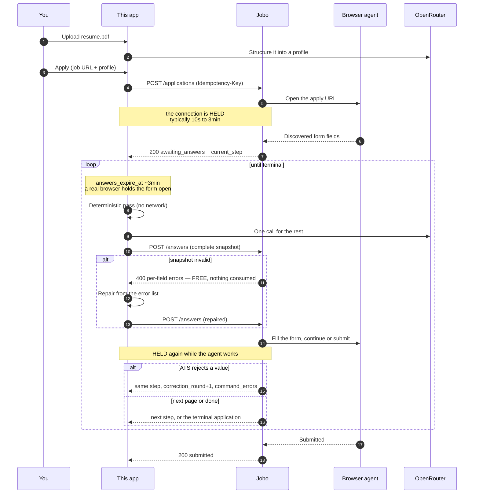

# Jobo Auto Apply — Next.js example

Pick a profile, paste a job URL, and watch Jobo drive the ATS form while this app answers its questions — synchronously, over plain HTTPS calls. No webhooks, no tunnels, no polling loops.

**The app is a notebook-style tutorial.** Open it and the whole loop sits on one page as three cells that unlock top to bottom — the blocking create that hands you the form's fields, the free validation that checks answers before anything touches the employer, and the answer engine driving submit-after-submit to a terminal state — each showing the actual code that runs, the actual bytes on the wire, and its live output. Two fictional sample profiles ship with the app so the first cell is runnable in one click; add real ones on the Profiles page. Progress is derived entirely from real state (env + SQLite), never stored; once you have watched one application reach a terminal state, the front page becomes a plain workbench.

**The interesting file is [`app/actions/applications.ts`](app/actions/applications.ts).** Everything else exists to give it something to answer with — and to teach you why.

---

## What this actually demonstrates

Auto Apply is **profileless**. Jobo stores no candidate profile, uploads no resume, and generates no answers. The entire public API is five endpoints:

```
POST   /api/auto-apply/applications               create   (BLOCKS until the first fields)
GET    /api/auto-apply/applications               list
GET    /api/auto-apply/applications/{id}          read     (?wait_seconds long-polls)
POST   /api/auto-apply/applications/{id}/answers  submit   (validates free, then BLOCKS)
POST   /api/auto-apply/applications/{id}/cancel
```

There is no profile endpoint, no resume upload, and no webhook. `create` holds the connection while a browser agent opens the page and discovers the form — typically 10 seconds to 3 minutes — and resolves with the fields in `current_step`. You answer them with `submitAnswers`, which **validates the snapshot synchronously before anything touches the employer's form** (a bad value is an immediate 400 with per-field errors, and costs nothing), then holds again while the agent fills the form and clicks through. The response is the next step, a correction round, or the terminal application. That is the whole loop.

So this app is not a client of the answer engine — it *is* the answer engine. That is the half of the integration Jobo deliberately does not own, and it is what this repo shows you how to build.



---

## Quickstart

```bash
npm install
cp .env.example .env.local   # fill in JOBO_API_KEY, OPENROUTER_API_KEY, a signing secret
npm run dev
```

That is the whole setup: three env values, no tunnel, no webhook secret, no portal ceremony. Check the keys before spending a create quota:

```bash
npm run doctor
```

Then open [http://localhost:3000](http://localhost:3000) — it drops you into the notebook, with the cells your setup has actually reached unlocked.

> [!NOTE]
> **Application creation may be gated during the preview.** `POST /applications` returns `503 auto_apply_coming_soon` until Jobo enables intake for your account — ask your Jobo contact. Reads, lists and cancels work regardless.

`PUBLIC_BASE_URL` is **optional**: everything works without it except `file` fields, because Jobo downloads the resume from a public HTTPS URL this app serves (https, port 443, public DNS — its SSRF guard rejects anything else, so localhost can never work). When unset, the answer engine skips file fields and records why in the trace; an application that *requires* a resume then cancels cleanly. Set it on a deployed origin to answer resume fields.

---

## The loop in 60 seconds

**Create blocks until the fields arrive.** Write your `Idempotency-Key` to local storage *before* the call: the connection can be held for up to 90 seconds per request, and if it drops — or the hold budget expires with a 202 snapshot — retrying with the same key **re-attaches to the in-flight application and its blocking wait** instead of creating a duplicate. Looping `GET /applications/{id}?wait_seconds=90` is the same re-attach from anywhere.

**A real browser is holding the form open.** Every answerable step carries `answers_expire_at` — about 3 minutes, 60 seconds for one-time verification codes. Miss it and the application fails with `answers_timeout`. The LLM budget in this app is derived from that deadline.

**Validation is free.** `submitAnswers` checks every value before anything touches the employer's form. A bad value is an immediate 400 carrying per-field errors — nothing consumed, no correction round burned. Fix and resubmit. This is why the app ships no local port of Jobo's validator: the server *is* the validator, at zero cost.

**Only the employer's ATS burns correction rounds.** If the ATS rejects a value after filling — something client-side validation cannot predict — the same step comes back with `correction_round` incremented and `command_errors` quoting what it said. Re-send a **complete snapshot** (the full field list comes back every round, not a delta). After 3 failed rounds: `correction_limit_exceeded`.

**Everything is safe to retry.** Reads re-attach; answers are accepted exactly once per correction round, and a duplicate post attaches to the same wait. The optional `correction_round` guard on submit refuses to answer a round you did not build the snapshot for (`409 stale_correction_round`).

**One-time email verification is just another step.** It arrives as a field with `format: "one_time_code"`, expires in 60 seconds, and is answered through the same `submitAnswers` call.

---

## The answer engine

Two passes, in this order for a reason: the deterministic pass needs no network, so an LLM timeout degrades to *fewer* answers rather than *no* answers.

| Situation | Producer | Why |
|---|---|---|
| `semantic_key` / label matches a profile field | **Rule** | Free, instant, exact. Never let a model retype an email address. |
| `type: 'file'` | **Rule** | Always the signed resume URL (skipped, with a trace note, when `PUBLIC_BASE_URL` is unset). |
| `repeating_group` | **Rule** | Ordering, the ≤10 cap, `is_current`/`end_date`, and dedupe are rules, not judgement. |
| Unambiguous option match | **Rule** | `country_code: "US"` onto an option `{value:"US"}`. |
| `sensitive: true` | **Applicant prompt** | Use the applicant-provided value; never ask the model to invent it. |
| `type: 'unknown'` | **Neither** | Unanswerable by contract. |
| Open-ended text | **LLM** | "Why this company", "describe a project". |
| Options needing semantic choice | **LLM** | "5-7 years" → the `senior` option. |

**Sensitive fields are never sent to the model.** For voluntary self-identification the order is: a value the user typed into the UI → the form's own "prefer not to say" option → leave it unanswered. Jobo does not infer either kind of answer.

**Typed slots, not a polymorphic `value`.** A `value` that is a string, number, boolean, array or object depending on a sibling field's type is exactly what strict JSON Schema handles worst, and the failure is silent. Instead the model declares a `kind` and fills the matching slot, and [`lib/answers/coerce.ts`](lib/answers/coerce.ts) turns that into the wire shape. `kind: "skip"` gives it an explicit way to decline instead of fabricating.

> [!NOTE]
> OpenRouter's strict mode **silently degrades to plain JSON mode** unless every object sets `additionalProperties: false` *and* lists **every** property in `required` — including the optional ones. Listing only the genuinely-required keys is the intuitive thing to do and it quietly turns your schema off. [`lib/json-schema.ts`](lib/json-schema.ts) enforces both invariants structurally, and [`tests/json-schema.test.ts`](tests/json-schema.test.ts) asserts them, because nothing at runtime will tell you.

**The repair pass runs on the server's own errors.** When the free validation refuses a snapshot, [`lib/answers/index.ts`](lib/answers/index.ts) repairs mechanically from the per-field error list — length clamps, `"yes"` → `true`, nearest option, date precision — and retries once. Anything that needs new information is withdrawn rather than resent broken.

**A clean cancel beats an incomplete submit.** If a `requires_answer` field cannot be answered, this app cancels and records why — the server would refuse the snapshot anyway, and the step deadline keeps running while you argue with it.

---

## Layout

```
app/actions/applications.ts       ★★ the centrepiece: start + advance, the whole loop
lib/answers/index.ts              ★  deterministic → LLM → coerce → decide, plus the repair pass
components/AutoRunner.tsx         ★  drives advance-after-advance from the browser
app/api/resumes/[profileId]/         signed public HTTPS PDF for `file` fields (optional)
lib/jobo/client.ts                   the SDK client, plus the one endpoint it omits
lib/answers/deterministic.ts         ordered rules, groups, sensitive-field policy
lib/answers/coerce.ts                typed slot → wire value, per field type
lib/json-schema.ts                   zod → strict-mode JSON Schema
lib/resume/                          unpdf extraction + OpenRouter structuring

app/learn/page.tsx                   the notebook tutorial (one page, three cells, no stored state)
lib/tutorial.ts                      cell states, derived from env + SQLite per request
db/schema.ts                         profiles, applications, and the steps audit table
db/seed.ts                           the two sample profiles, reseeded idempotently at boot
lib/snippets.ts                      tutorial code panels read the REAL source files
components/StatusTimeline.tsx        created → queued → … → terminal, live
components/ApplicationInspector.tsx  step log + Jobo's view (shared with /applications)
app/page.tsx                         router: tutorial until complete, workbench after
```

Blocking-call plumbing, idempotent retries and per-field validation errors are not in this list because they are not this app's code — they come from [`@jobo-ai/autoapply`](https://www.npmjs.com/package/@jobo-ai/autoapply), the same package we publish for you. Open the three ★ files in that order and you have seen the integration. The tutorial opens them for you, in that order, with the relevant lines rendered inline — snippets are read from the source files at request time, so they cannot drift from the code.

The visual system is ported from the Jobo Enterprise portal style guide: flat white surfaces, hairline borders, square corners, one purple accent, mono uppercase labels.

---

## Environment

| Variable | Notes |
|---|---|
| `JOBO_API_KEY` | `jbe_live_…` or `jbe_test_…`. Master keys are rejected on Auto Apply routes. |
| `JOBO_API_BASE_URL` | Defaults to `https://connect.jobo.world`. |
| `PUBLIC_BASE_URL` | **Optional.** Only needed to serve resume files for `file` fields. https, port 443, publicly resolvable. |
| `RESUME_URL_SIGNING_SECRET` | Signs resume download URLs. `openssl rand -base64 32`. |
| `OPENROUTER_API_KEY` | — |
| `OPENROUTER_ANSWER_MODEL` | Default `deepseek/deepseek-v4-flash-0731`. Latency matters against the ~3 minute step deadline. |
| `OPENROUTER_RESUME_MODEL` | Default `deepseek/deepseek-v4-flash-0731`. Runs once per resume, with no clock pressure — a slower, stronger model is a reasonable swap. |
| `ANSWER_BUDGET_MS` | Default 45000. Ceiling, not a target — the real budget is derived from `answers_expire_at`. |
| `DATA_DIR`, `DEFAULT_SANDBOX` | — |
| `RESTRICT_APPLY_HOSTS` | Default `false`. `true` refuses any apply URL outside `ALLOWED_APPLY_HOSTS` — turn it on for a shared deployment so a visitor cannot apply to a real posting on your key. |
| `ALLOWED_APPLY_HOSTS` | Default `sandbox.jobo.world`. Matched on hostname exactly; a leading `.` marks a suffix. |

---

## Troubleshooting

| Symptom | Cause | Fix |
|---|---|---|
| The create call "hangs" | It is supposed to | `create` blocks until the fields are discovered — 10s to 3min, in holds of up to 90s. A 202 snapshot means the hold budget expired, not a failure; keep re-attaching with `get(id, { waitSeconds: 90 })` until answerable or terminal. |
| `answers_timeout` | The ~3 minute step deadline passed before answers were submitted | A real browser was holding the form open. Check what stalled the engine — usually a slow model; `ANSWER_BUDGET_MS` caps the LLM call. |
| 400 with per-field errors on submit | The snapshot failed validation | **Free** — nothing consumed. Fix the listed fields and submit again; the repair pass does exactly this. |
| `stale_correction_round` (409) | You answered a round that has moved on | Re-fetch the application and answer `current_step` as it is now. |
| `correction_limit_exceeded` | The **employer's ATS** rejected the answers 3 times | Open the step log — `command_errors` names the exact fields. Usually a missing option alias. |
| `invalid_file` / skipped resume fields | No public origin to serve the resume from | Set `PUBLIC_BASE_URL` to a public HTTPS origin (port 443, public DNS), or accept that file fields are skipped. |
| `auto_apply_coming_soon` | The launch gate | See the note in Quickstart. |
| `idempotency_key_reuse` | Same key, different body | Keys are bound to the exact body for 24h. |
| Upload fails with an opaque error | Server Action 1 MB body cap | Uploads go through a **route handler** here for exactly this reason. |
| A proxy kills long requests | Blocking calls held for minutes | Raise your reverse proxy's read timeout (this repo's demo deployment uses 600s). |

---

## Deliberately out of scope

Multi-user auth · OCR for scanned PDFs · SSE/websockets (each blocking response already carries the next state) · job-description fetching · cover-letter generation · background queues · Postgres.

Each would be worth adding in a real product. None of them teach you anything about Auto Apply, and every one of them would make the three ★ files harder to find.

> `npm audit` reports advisories in `next`'s own bundled `postcss`/`sharp` and in `drizzle-kit`'s dev-only `esbuild`. Both are already on their latest versions — npm's suggested "fixes" are downgrades to `next@9` and `drizzle-kit@0.18`. Nothing to do but wait for upstream.

## License

MIT.
