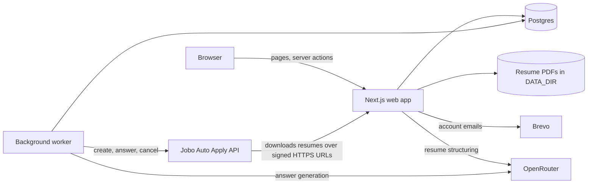

# Jobo Auto Apply example

A complete, working integration of the [Jobo Auto Apply API](https://jobo.world/docs/api-reference/auto-apply/auto-apply) in Next.js. Candidates create an account, upload a resume and review the profile it produces, then apply to jobs while a background worker runs each application end to end.

It runs in two modes:

- **Sandbox** (the default): fictional jobs on `sandbox.jobo.world`, applied to with the deployment's own API key. No employer is ever contacted.
- **Production** (optional): the visitor connects their own Jobo API key, searches the live job catalog and applies to real employers, after accepting a one-time warning.

Fork it as the starting point for your own Jobo-powered product, or read it to see how the pieces fit.

**[Try the live demo](https://demo.jobo.world)** · **[Auto Apply docs](https://jobo.world/docs/api-reference/auto-apply/auto-apply)** · **[Source](https://github.com/JoboAI/jobo-auto-apply-example)**

## Contents

- [What it shows](#what-it-shows)
- [Architecture](#architecture)
- [How the Auto Apply loop works](#how-the-auto-apply-loop-works)
- [Run it locally](#run-it-locally)
- [Configuration](#configuration)
- [Find your way around the code](#find-your-way-around-the-code)
- [Answer generation](#answer-generation)
- [Production mode](#production-mode)
- [Reliability and recovery](#reliability-and-recovery)
- [Build your own](#build-your-own)
- [Deploy](#deploy)
- [Checks](#checks)
- [Troubleshooting](#troubleshooting)

## What it shows

| Your app owns | Auto Apply handles |
| --- | --- |
| Accounts, consent, reviewed profiles and resume files | Opening the employer's application form |
| Turning candidate facts into answers (rules first, one model call for the rest) | Discovering typed fields and their validation rules |
| A durable queue and worker that survive restarts | Filling answers, moving through pages, reporting corrections |
| Presenting progress and results | Reporting `submitted`, `failed` or `canceled` |

The API stores no candidate profiles and writes no answers: those live here. The integration uses the [`@jobo-ai/autoapply`](https://www.npmjs.com/package/@jobo-ai/autoapply) SDK and needs no webhook receiver.

## Architecture


```mermaid
flowchart LR
  browser[Browser] -->|pages, server actions| web[Next.js web app]
  web --> db[(Postgres)]
  web --> files[(Resume PDFs in DATA_DIR)]
  web -->|account emails| brevo[Brevo]
  web -->|resume structuring| openrouter[OpenRouter]
  worker[Background worker] --> db
  worker -->|create, answer, cancel| jobo[Jobo Auto Apply API]
  worker -->|answer generation| openrouter
  jobo -->|downloads resumes over signed HTTPS URLs| web
```

Two processes share one database, one PDF directory and one set of secrets:

- **The web app** (`next start`) serves pages, handles sign-in and resume uploads, and turns an Apply click into a queued row. It never calls Auto Apply for an application.
- **The worker** (`npm run worker`) claims queued applications, drives them through the API, and writes every result back. The browser just polls those rows, so an application keeps going after the tab closes.

## How the Auto Apply loop works

Auto Apply is synchronous: each call blocks until there is something for you to do, and the response is the next state. The whole loop lives in [`lib/application-engine.ts`](lib/application-engine.ts), with its full explanation at the top of the file.

1. **Create.** `applications.create({ apply_url })` (sandbox) or `{ job_id }` (production), with an idempotency key stored before the first call. It blocks until Jobo has opened the form and found the first step's fields.
2. **Answer.** The application comes back `awaiting_answers` with `current_step.fields`. [`lib/answers`](lib/answers/) builds a complete answer snapshot, the app stores it, then sends it with `submitAnswers`.
3. **Advance.** `submitAnswers` blocks while Jobo fills the form, then returns the next step, a correction round (the same step with the employer system's errors), or the final application.

A few rules make it safe to run unattended:

- **Validation errors are free.** A `400` from `submitAnswers` changes nothing on the employer's side. The app repairs the answers once from the per-field errors and resends.
- **Long waits come back as `202`.** Jobo holds a request for at most about nine minutes, then returns the application still `queued` or `running`. The worker stores that and re-attaches next time with `applications.get(id, { waitSeconds })`.
- **Nothing is sent twice.** The create idempotency key and each step's answers are written to Postgres before the request goes out, so a crash or timeout replays the same request instead of starting a new one.
- **Verification codes stop the run.** A step asking for an emailed one-time code cancels the application with an explanation. The SDK's [`mailboxes`](https://jobo.world/docs/api-reference/auto-apply/mailboxes) resource can fetch those codes if you connect the candidate's inbox; this example does not.

Further reading: [the application loop](https://jobo.world/docs/api-reference/auto-apply/flow) and [the field schema](https://jobo.world/docs/api-reference/auto-apply/schema).

## Run it locally

### Prerequisites

- **Node.js 22+** and npm.
- **Docker**, for the local Postgres (or bring your own `DATABASE_URL`).
- A **Jobo API key with Auto Apply access**. [Request access in the portal](https://enterprise.jobo.world/auto-apply/applications). Signing up to the demo does not give your key access.
- An **OpenRouter API key**, for resume structuring and answers.
- A **Brevo API key** and a verified sender, for verification and password-reset emails.
- A **public HTTPS origin** for this app, to complete applications. Jobo downloads the candidate's resume from it. A tunnel to `localhost:3000` (Cloudflare Tunnel, ngrok, …) works for development.

### Steps

```sh
git clone https://github.com/JoboAI/jobo-auto-apply-example.git
cd jobo-auto-apply-example
npm ci
cp .env.example .env.local   # then fill it in: see Configuration
```

```sh
npm run db:up    # local Postgres in Docker, on port 5433
npm run doctor   # checks the environment and every service it needs
npm run dev      # applies migrations, then starts Next.js on localhost:3000
```

In a second terminal, start the worker. Without it, applications stay queued.

```sh
npm run worker
```

Open [localhost:3000](http://localhost:3000), sign up and verify your email, then upload a text-based PDF resume. [`tests/fixtures/ada-lovelace.pdf`](tests/fixtures/ada-lovelace.pdf) is a fictional one you can use. Review the profile, apply to a sandbox job, and follow it on the application page. Expand **API requests & responses** to see every HTTP exchange, with credentials redacted. Close the tab and come back: it keeps going.

## Configuration

All configuration is environment variables, read and validated in [`lib/config.ts`](lib/config.ts). [`.env.example`](.env.example) lists every one with a comment. Nothing is exposed to the browser.

| Variable | Required | Purpose |
| --- | --- | --- |
| `JOBO_API_KEY` | Yes | Jobo key with Auto Apply access (`jbe_live_…` / `jbe_test_…`). Sandbox applications use it. |
| `OPENROUTER_API_KEY` | Yes | Resume structuring and answer generation |
| `DATABASE_URL` | Yes | Postgres connection URL |
| `BETTER_AUTH_URL` | Yes | This app's origin, used in account emails. `http://localhost:3000` locally. |
| `BETTER_AUTH_SECRET` | Yes | Session signing secret, at least 32 characters |
| `BREVO_API_KEY` | Yes | Sends verification and password-reset emails |
| `AUTH_EMAIL_FROM` | Yes | A sender verified in your Brevo account |
| `RESUME_URL_SIGNING_SECRET` | Yes | Signs resume download URLs, at least 32 characters |
| `PUBLIC_BASE_URL` | To apply | Public HTTPS origin Jobo downloads resumes from (port 443, no path). The health check requires it. |
| `DATA_DIR` | No | Resume PDF directory, shared by web app and worker. Default `./.data`. |
| `API_KEY_ENCRYPTION_SECRET` | No | Enables [production mode](#production-mode). At least 32 characters. |
| `JOBO_API_BASE_URL` | No | Default `https://connect.jobo.world` |
| `JOBO_STATUS_URL` | No | Public list of supported application systems, for production search |
| `OPENROUTER_ANSWER_MODEL` | No | Default `~deepseek/deepseek-v4-flash-latest` |
| `OPENROUTER_RESUME_MODEL` | No | Default `deepseek/deepseek-v4-flash-0731` |
| `OPENROUTER_PROVIDER_SORT` | No | `throughput` (default), `latency` or `price` |
| `OPENROUTER_APP_NAME`, `OPENROUTER_APP_URL` | No | Attribution shown in your OpenRouter dashboard |
| `ANSWER_BUDGET_MS` | No | Ceiling for one answer-model call. Default `90000`. |
| `WORKER_CONCURRENCY`, `WORKER_USER_CONCURRENCY` | No | Applications running at once, in total and per candidate. Defaults `2` and `1`. |
| `DATABASE_POOL_MAX` | No | Postgres connections per process. Default `10`. |
| `LOG_LEVEL` | No | `debug`, `info` (default), `warn` or `error` |
| `TRUSTED_IP_HEADER` | No | Client-IP header for sign-in rate limits. Only set it behind a proxy that overwrites the header. |

Generate each secret separately, for example with `openssl rand -hex 32`. The worker, `npm run doctor` and migrations read `.env.local` themselves. Variables already set in the environment take precedence, so containers and service managers work unchanged.

## Find your way around the code

| Path | What it does |
| --- | --- |
| [`lib/application-engine.ts`](lib/application-engine.ts) | The Auto Apply loop: create, answer, wait, cancel, recover |
| [`lib/queue.ts`](lib/queue.ts) | Durable queue in Postgres: enqueue, claim with leases, concurrency caps, retries |
| [`lib/worker.ts`](lib/worker.ts), [`scripts/worker.ts`](scripts/worker.ts) | The worker loop and its process entry point |
| [`lib/jobo/client.ts`](lib/jobo/client.ts) | SDK client setup and redacted request recording |
| [`lib/answers/`](lib/answers/) | Answer pipeline: deterministic rules, one model call, coercion, repair after validation errors |
| [`lib/resume/`](lib/resume/) | PDF text extraction, structuring into a profile, the profile schema, file storage |
| [`lib/jobs.ts`](lib/jobs.ts) | Sandbox job catalog and the destination checks every application passes |
| [`lib/jobo/jobs-api.ts`](lib/jobo/jobs-api.ts), [`job-filters.ts`](lib/jobo/job-filters.ts), [`supported-ats.ts`](lib/jobo/supported-ats.ts) | Production mode: Jobs API search, job and company lookups, URL filter state, supported application systems |
| [`lib/user-settings.ts`](lib/user-settings.ts), [`lib/secret-box.ts`](lib/secret-box.ts) | Per-visitor mode, and the visitor's API key sealed with AES-256-GCM |
| [`lib/signed-url.ts`](lib/signed-url.ts) | Short-lived signed resume URLs for Jobo to download |
| [`lib/jobo/recording-fetch.ts`](lib/jobo/recording-fetch.ts), [`api-preview.ts`](lib/jobo/api-preview.ts) | Captures and redacts the HTTP exchanges shown in the UI |
| [`lib/auth.ts`](lib/auth.ts), [`lib/session.ts`](lib/session.ts) | Accounts (better-auth) and account emails (Brevo) |
| [`lib/config.ts`](lib/config.ts) | Environment validation |
| [`db/schema.ts`](db/schema.ts), [`db/migrations/`](db/migrations/) | Database schema and migrations (Drizzle) |
| [`app/`](app/) | Routes: pages, [server actions](app/actions/) and [route handlers](app/api/) |
| [`components/`](components/) | UI, including the job feed and explorer ([`JobFeed`](components/JobFeed.tsx), [`JobExplorer`](components/JobExplorer.tsx)), the mode switch ([`ModeToggle`](components/ModeToggle.tsx)) and live progress ([`ApplicationLive`](components/ApplicationLive.tsx)) |
| [`scripts/doctor.ts`](scripts/doctor.ts), [`scripts/worker-health.ts`](scripts/worker-health.ts) | Preflight checks and the worker's health probe |

## Answer generation

Each step's fields go through [`lib/answers`](lib/answers/index.ts):

1. **Deterministic rules** fill everything that has a known answer: name, email, phone, links, dates, the resume file, work history, education, exact option matches, work authorization and self-identification.
2. **One structured model call** (OpenRouter) answers the remaining eligible fields, using the reviewed profile, resume text and job description. Reasoning is off. The call gets the time left before the step's deadline, capped at `ANSWER_BUDGET_MS`.
3. **Coercion** fits every value to its field's type and options. Anything still missing is left out.

If the model call fails, the app still submits when the rules cover every required field. Missing required facts, verification codes and a rejected model key stop the application with an explanation.

Some answers are never left to a model:

- **Self-identification** (gender, ethnicity, veteran, disability, LGBTQ+) is collected explicitly during onboarding and filled by fixed rules in [`lib/answers/eeo.ts`](lib/answers/eeo.ts). With no exact match, the form's own decline option is chosen.
- **Work authorization and age** come only from what the candidate stated. A form that needs a missing fact cannot be completed automatically.
- The date of birth and self-identification answers are never sent to the model.

The profile model ([`lib/resume/profile-schema.ts`](lib/resume/profile-schema.ts)) covers personal info, links, education, experience, projects, skills, languages, work authorization (US, Canada and UK, plus other countries), equal employment info and job preferences.

## Production mode

Set `API_KEY_ENCRYPTION_SECRET` to turn it on. The top bar then switches between **Sandbox** and **Production**. Production asks for the visitor's own Jobo API key and shows a one-time warning that applications go to real employers. Then:

- **Search** uses `POST /api/jobs/search` on the visitor's key, limited to the application systems Auto Apply supports. That list comes from `JOBO_STATUS_URL`, with a built-in fallback. Search is billed per job returned, so results are cached in memory for five minutes per key and query.
- **Job pages** use the free `GET /api/jobs/{id}` and `GET /api/companies/{id}`. They show every field the API returns, plus the raw JSON. ATS logos live in `public/ats-logos/`, mapped in [`lib/jobo/supported-ats.ts`](lib/jobo/supported-ats.ts).
- **Applications** are created with `job_id` on the visitor's key, so they belong to the visitor's Jobo account. That account needs Auto Apply enabled. Jobo checks this at create time, and the app explains `auto_apply_not_enabled` and similar refusals.
- **The key** is stored sealed with AES-256-GCM ([`lib/secret-box.ts`](lib/secret-box.ts)), because the worker needs it after the browser closes. Each queued application keeps its own sealed copy, so a run finishes on the key it started with. That copy is erased when the run ends. Disconnecting deletes the stored key. Rotating `API_KEY_ENCRYPTION_SECRET` disconnects every key.

## Reliability and recovery

- Every Apply click freezes a copy of the reviewed profile and the resume PDF. Later edits never change a running application.
- Workers claim applications with renewable leases. The global and per-candidate caps hold across any number of workers. Every engine write checks the lease, so a worker that lost its claim cannot overwrite the new owner's progress.
- A failed attempt backs off exponentially. After six in a row, the application is paused as `recovery_required`. It is then only reconciled (status checked, canceled) if Jobo already knows about it, and never created again.
- Create recovery gives up after 20 hours, before the API's 24-hour idempotency window closes. Submissions that may have happened are never retried automatically.
- Resume downloads need either ownership (the candidate) or an expiring HMAC signature scoped to one application (Jobo).
- The **API requests & responses** panel records up to 100 exchanges per application, with credentials and signed URLs redacted. A missing response is never taken as proof that nothing was submitted.

## Build your own

The example is meant to be taken apart. Common changes:

- **Use your own candidate data.** Replace the upload and review flow with your existing profiles. The engine only needs the `ProfileSnapshot` shape in [`db/schema.ts`](db/schema.ts) (profile JSON, resume text, resume file).
- **Change how answers are made.** Add rules in [`lib/answers/deterministic.ts`](lib/answers/deterministic.ts) (each one has an id, a matcher and a resolver), adjust the prompt in [`lib/answers/prompt.ts`](lib/answers/prompt.ts), or point `OPENROUTER_ANSWER_MODEL` at another model. To use a different LLM provider, replace [`lib/openrouter.ts`](lib/openrouter.ts). It is one function that returns schema-validated JSON.
- **Bring your own jobs.** `startApplicationAction` in [`app/actions/applications.ts`](app/actions/applications.ts) resolves a job, then queues it. Create applications from any job you can give Jobo, as an `apply_url` or a Jobo `job_id`.
- **Store files elsewhere.** Swap [`lib/resume/storage.ts`](lib/resume/storage.ts) for S3, R2 or GCS, and give Jobo the store's presigned URL instead of [`lib/signed-url.ts`](lib/signed-url.ts).
- **Send email another way.** `sendAccountEmail` in [`lib/auth.ts`](lib/auth.ts) is the only Brevo code.
- **Run more workers.** Start more `npm run worker` processes. The caps in `WORKER_CONCURRENCY` still hold, because the claim takes a Postgres advisory lock. Several web replicas also need shared resume storage and a shared search cache.
- **Restyle it.** All styling is in [`app/globals.css`](app/globals.css), driven by the design tokens at the top of the file.

## Deploy

Run two processes from the same image (the [`Dockerfile`](Dockerfile)): the web app (the image's default command) and the worker (`node --import tsx scripts/worker.ts`; run it with `node` rather than `npm` so it receives `SIGTERM` and drains). Both need the same environment, the same Postgres, and the same persistent volume at `DATA_DIR`. Apply migrations before starting a new version with `npm run db:migrate`, which is safe to run concurrently.

To try the full stack in containers locally:

```sh
docker compose --profile app up --build
```

Before going live:

- Point `BETTER_AUTH_URL` and `PUBLIC_BASE_URL` at your own HTTPS origin.
- Use `GET /api/health` for readiness. It returns `503` and lists the names of missing variables. Use `npm run worker:health` for the worker's liveness.
- Give the worker a few minutes to stop. On `SIGTERM` it finishes the exchanges in flight.
- Back up Postgres and the PDF directory together. Migrations only move forward.
- Check signup email, a resume upload, one sandbox application to **Submitted**, and a worker restart mid-application.

## Checks

```sh
npm run db:up      # tests need Postgres
npm run check      # lint, format check, typecheck, unit and integration tests
npm run build
npx playwright install chromium   # once
npm run test:e2e
```

Each test file gets its own throwaway database, cloned from a migrated template. Use `TEST_DATABASE_URL` to point tests at a Postgres login that can create databases. The browser suite starts an isolated server with stubbed Jobo, OpenRouter and email responses. It never sends real email, calls a model or submits a real application.

## Troubleshooting

| Symptom | Check |
| --- | --- |
| `npm run doctor` fails on the Jobo key with `403` | The account owning `JOBO_API_KEY` needs Auto Apply access |
| Applications stay **Queued** | The worker is running against the same database and `.env.local` |
| No verification email | `npm run doctor` checks the Brevo key and that `AUTH_EMAIL_FROM` is an active sender. Then check spam. |
| Applications stop at a resume field | `PUBLIC_BASE_URL` must reach this app over public HTTPS, and web and worker must share `DATA_DIR` and the signing secret |
| An application **Couldn't complete** | The application page names the missing answers. The API exchanges panel shows each call. Do not blindly retry an unconfirmed submission. |
| `relation "…" already exists` when migrating | Your database predates the squashed migrations (October 2026). Recreate it: `docker compose down -v`, then `npm run db:up`. |
| Tests cannot connect to Postgres | Run `npm run db:up`, or set `TEST_DATABASE_URL` |

## Scope

Supports text-based PDF resumes. Not included: OCR, DOCX, bulk applications, billing, mailbox connections for verification codes, and mobile apps.

## Contributing and license

This repository is a read-only mirror of `Jobo.Examples/auto-apply` in Jobo's main repository. Changes pushed here are overwritten by the next sync. Report bugs and suggestions as [GitHub issues](https://github.com/JoboAI/jobo-auto-apply-example/issues). See [CONTRIBUTING.md](CONTRIBUTING.md), and [SECURITY.md](SECURITY.md) for vulnerabilities.

[MIT](LICENSE)
